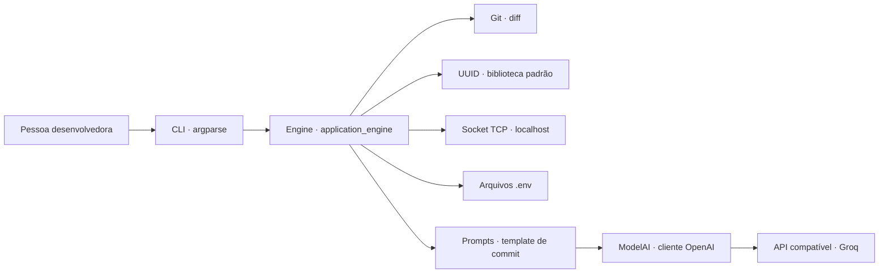

# ARR Tool

**Um kit compacto de produtividade para quem trabalha com código.** O ARR Tool reúne utilitários de Git, rede e configuração em uma CLI simples, com uma integração de IA para sugerir mensagens de commit a partir das mudanças do projeto.

[](https://www.python.org/)

## Por que existe

Pequenas tarefas aparecem o tempo todo no fluxo de desenvolvimento: preparar uma mensagem de commit, gerar um identificador, conferir uma porta ou criar um exemplo de configuração sem os valores secretos. O ARR Tool coloca essas ações em comandos curtos e deixa a lógica reunida em um motor Python reutilizável.

## Funcionalidades

| Comando | O que faz |
| --- | --- |
| `arr-tool commit-message` | Lê o `git diff` do diretório atual e pede à IA uma sugestão de mensagem de commit em uma linha. Não cria o commit. |
| `arr-tool uuid` | Gera um UUID versão 4. |
| `arr-tool verify-port <porta>` | Verifica se uma conexão TCP com `localhost` nessa porta é aceita. |
| `arr-tool env-example` | Lê `.env` e gera ou sobrescreve `.env.example` com os nomes das variáveis e valores vazios. |

## Instalação

Requer Python 3.10 ou superior.

## Instalação via PyPI

A forma mais simples de instalar o ARR Tool é diretamente pelo PyPI:

```bash
python -m pip install arr-tool
```

Depois da instalação, o comando arr-tool estará disponível no ambiente:

```bash
arr-tool uuid
```

## Instalação para desenvolvimento

Para clonar o projeto e trabalhar diretamente no código-fonte:

```bash
git clone https://github.com/arthurrodriguessdev/arr-tool.git
cd arr-tool
python -m venv .venv
source .venv/bin/activate  # Windows PowerShell: .venv\Scripts\Activate.ps1
python -m pip install .
```

A instalação inclui as dependências Python da integração com IA. Os comandos locais (`uuid`, `verify-port` e `env-example`) não precisam de credenciais de IA.

## Uso

Depois de instalar, o comando `arr-tool` fica disponível no ambiente:

```bash
arr-tool uuid
# Generated UUID: 2c1c3a73-8f90-4a0a-a8d4-2ed3a56a6c31

arr-tool verify-port 8000
# The status port is: AVAILABLE

arr-tool env-example
# Your file was generated successfully
```

O resultado de `verify-port` refere-se a uma conexão TCP em `localhost`: `AVAILABLE` significa que nenhum serviço aceitou a conexão durante a verificação; `NO AVAILABLE` significa que a conexão foi aceita.

### Sugestão de mensagem de commit

O comando precisa ser executado dentro de um repositório Git com alterações visíveis em `git diff`. Configure no arquivo `.env` as credenciais do provedor compatível com a API OpenAI (Groq é o exemplo abaixo):

```dotenv
GROQ_API_KEY=sua_chave_de_api
GROQ_API_URL=https://api.groq.com/openai/v1
GROQ_API_MODEL=seu_modelo_disponivel
```

Então execute:

```bash
arr-tool commit-message
# Generated message: adicionar verificação de porta TCP
```

`GROQ_API_URL` e `GROQ_API_MODEL` dependem da API e do modelo disponíveis na sua conta. Mantenha credenciais em `.env`, não as publique e revise a sugestão antes de usá-la. O diff é enviado ao provedor configurado para gerar a mensagem.

### Uso como biblioteca Python

As operações também podem ser chamadas diretamente. O motor está disponível no módulo `application_engine`:

```python
from arr_tool.application_engine import Engine

engine = Engine()

identifier = engine.generate_uuid()
print(identifier)

port_is_available = engine.socket_verify(8000)
print(port_is_available)
```

Para gerar uma sugestão de commit, use `Engine().commit_message()` com as variáveis de ambiente configuradas. O método usa o `git diff` do diretório de trabalho atual e requer acesso à API de IA.

## Arquitetura

O fluxo é intencionalmente pequeno: a CLI interpreta o comando, o motor executa a operação e os adaptadores especializados acessam Git, rede, sistema de arquivos ou o provedor de IA.



### Estrutura do código

```text
src/arr_tool/
├── cli.py                 # Interface de linha de comando
├── application_engine.py  # Orquestração das operações
├── ai.py                  # Cliente da API e leitura de configuração
└── prompts.py             # Instruções para a sugestão de commit
```

## Licença

Este projeto está licenciado sob a MIT License.